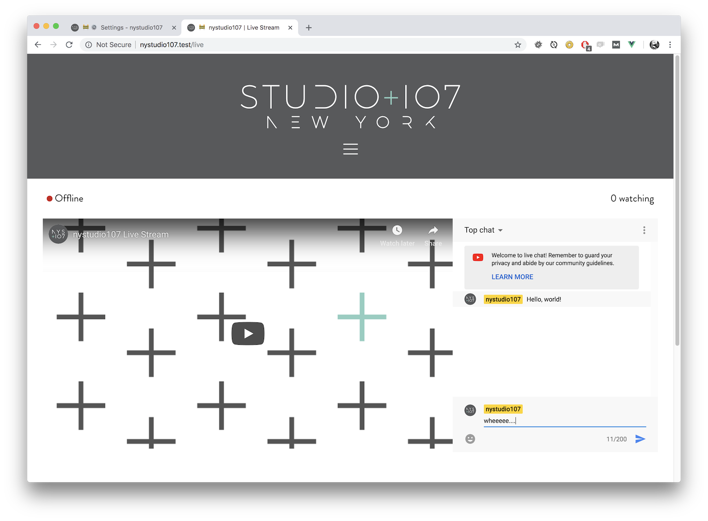

[](https://scrutinizer-ci.com/g/nystudio107/craft-youtubeliveembed/?branch=v1) [](https://scrutinizer-ci.com/g/nystudio107/craft-youtubeliveembed/?branch=v1) [](https://scrutinizer-ci.com/g/nystudio107/craft-youtubeliveembed/build-status/v1) [](https://scrutinizer-ci.com/code-intelligence)

# YouTube Live Embed plugin for Craft CMS 3.x

This plugin allows you to embed a YouTube live stream and/or live chat on your webpage


## Requirements

This plugin requires Craft CMS 3.0.0-beta.23 or later.

## Installation

To install the plugin, follow these instructions.

1. Open your terminal and go to your Craft project:

        cd /path/to/project

2. Then tell Composer to load the plugin:

        composer require nystudio107/craft-youtubeliveembed

3. In the Control Panel, go to Settings → Plugins and click the “Install” button for YouTube Live Embed.

You can also install Webperf via the **Plugin Store** in the Craft Control Panel.

## YouTube Live Embed Overview

YouTube Live Embed allows you to embed a YouTube live stream and/or live chat on your webpage.

You can also use it to determine whether a stream is currently live, and how many people are currently viewing the live stream.

Both the live stream and the live stream chat are embedded as responsive `<iframe>` elements, that you can control the aspect ratio of should you so wish.



## Configuring YouTube Live Embed

The only configuration is the **YouTube Channel ID** in the plugin settings. If you do not know your YouTube Channel ID, [here is how to find it](https://support.google.com/youtube/answer/3250431?hl=en).

You can also override this setting in the `config.php` or at runtime via Twig, should you need to (see below).

## Using YouTube Live Embed

You can see an example of YouTube Live Embed being used live on at [nystudio107.com/live](https://nystudio107.com/live).

In order to embed a YouTube Live Stream on a website, you need:
1. Live Streaming is enabled
2. Embedding of Live Streaming is enabled
3. Monetization is enabled

You can find these on the [YouTube Features](https://www.youtube.com/features) page, and read more about it in the [Enable embedded live streams from YouTube](http://docs.crowdcast.io/other/enable-embedded-live-streams-from-youtube)

If you haven't satisfied the above requirements, when someone goes to play your live stream embedded on your website, they will see this message (you can test it with an Incognito browser):

```
Video unavailable
Watch this video on YouTube.
Playback on other websites has been disabled by the video owner.
```

N.B. That in order to enable Monetization, you must have a linked AdSense account. Just enabling monetization is enough, and ads must be enabled, but they will not appear in your videos unless you specifically enable them.

### Embedding a Live Stream Video

To embed a live stream video, simply do:

```twig
    {{ craft.youtubelive.embedStream() }}
```

This will embed a responsive `<iframe>` element with a fixed aspect ratio that grows to fill its parent container.

The default aspect ratio is **16:9** but you can also optionally change it via:

```twig
    {{ craft.youtubelive.embedStream(ASPECT_RATIO_X, ASPECT_RATIO_Y) }}
```

If you have a Google AMP page, you can use:

```twig
    {{ craft.youtubelive.embedStreamAmp() }}
```

### Embedding a Live Stream Chat

To embed a live stream chat, simply do:

```twig
    {{ craft.youtubelive.embedChat() }}
```

This will embed a responsive `<iframe>` element with a fixed aspect ratio that grows to fill its parent container.

The default aspect ratio is **16:9** but you can also optionally change it via:

```twig
    {{ craft.youtubelive.embedChat(ASPECT_RATIO_X, ASPECT_RATIO_Y) }}
```

If you have a Google AMP page, you can use:

```twig
    {{ craft.youtubelive.embedChatAmp() }}
```

### Changing the Channel ID

By default, the YouTube Channel ID you specify in the plugin's settings will be used, but you can also change it dynamically via:

```twig
    
```

This could be useful if you had a website where you had more than one streaming channel to contend with.

If you do not know your YouTube Channel ID, [here is how to find it](https://support.google.com/youtube/answer/3250431?hl=en).

### Determining if the Stream is Live

To determine if the YouTube Video Stream is live, you can do:

```twig
    
    
```

### Determining the Number of Live Viewers

To determine the number of viewers watching the live YouTube Video Stream, you can do:

```twig
    
```

## YouTube Live Embed Roadmap

Some things to do, and ideas for potential features:

* Release it

Brought to you by [nystudio107](https://nystudio107.com)
